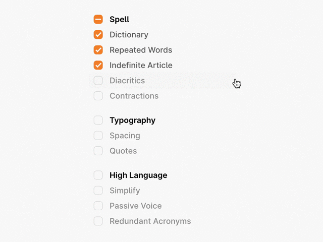

I always thought it’s a lousy reason not to publish something because you’re unhappy with the quality. From our experience with other projects (Hello Glyphfinder Windows version!), I learned: It’s a pretty good reason.

## People complain, and that’s fine.
Products that don’t have a quality lead to more work. People complain on Twitter, send (angry) support emails, write negative blog articles, ask for missing features, and report strange bugs.

That’s fine, as long as we still believe in the idea and think putting more time into it will improve it. But it is a distraction for products we can’t fix in a reasonable amount of time.

## What we did wrong with matter.md.

> “Get rid of the stupid mistakes and clutter nobody needs. Write with style and attention to detail.”

A few months ago, we announced to work on a new macOS app called [matter.md](https://matter.md) and everyone was hyped.
We never really told what it’s about though.

Here it is: It’s a Markdown text editor with a ton of language checks to make you a fantastic writer, and we had big plans for it. We even commissioned an amazing artwork that probably no one will ever see now. The whole app has two huge parts that we needed to get right:

**For the actual text editing part**,where we made the mistake of working with the wrong technology (CodeMirror vs. ProseMirror). That led to really, really bad performance for long documents. Fixing that would mean to completely rewrite the editing part, plus going away from Markdown.

**The language checks are not good enough for that purpose.** We saw that one as the most significant risk from the beginning but hoped to get it fixed somehow. It turned out it’s just not feasible. It’s complex to improve those checks, and you need to know a lot about the English language (Hint: We don’t).

And even then, the technology we used doesn’t read the context; it scans for words. It’s like a ton of bad word lists, which is sufficient for many use cases, but not for an editor that is supposed to improve your writing skills.

Let’s be honest. Those two are big mistakes and would take a tremendous amount of time to fix for a probably still unsatisfying result. We decided not to release it, not even for free.

## The lesson we have learned.
It seemed to be a great shortcut to build apps on top of the work of others. In this case, the otherwise [excellent retext plugin system](https://github.com/retextjs/retext/blob/main/doc/plugins.md). It’s not per se, not like we did it.

And we should have put more time into our prototype without wasting too much time with the beautiful interface design. But I think we’ll never learn that lesson.

## Stay positive.
The good thing: I don’t see us throwing this project away, but “on hold” is the best option for now.

I’m pretty sure we’re building something different text related. Maybe we can use parts of matter.md for whatever that will be (the user interface had many fans). If not, we can still release it anytime (paid or free), nothing to lose here.

If you have - like I do - the feeling in your gut that not releasing things like that is a mistake, read about the psychological reasons here: [Sunk cost on Wikipedia](https://en.wikipedia.org/wiki/Sunk_cost).

That said: If you believe in your thing, release it! Even if it’s crappy. You can do it! But don’t feel ashamed not to release something. It’s okay too.

<small>Thanks to [Titus](https://twitter.com/wooorm) for building the excellent unified js ecosystem that we use everywhere (even to process the blog post you’re currently reading). Thanks to [Marijn Haverbeke](https://twitter.com/MarijnJH) for making CodeMirror & ProseMirror, both are also excellent tools we still use a ton. And thanks to [Julian Lehr](https://twitter.com/lehrjulian), [Marcel Pociot](https://twitter.com/marcelpociot) and [Jack McDade](https://twitter.com/jackmcdade) for testing matter.md early on.</small>