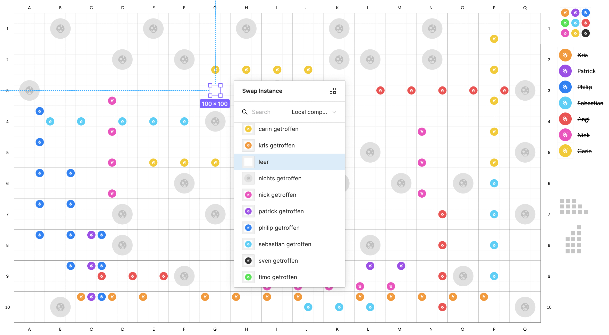
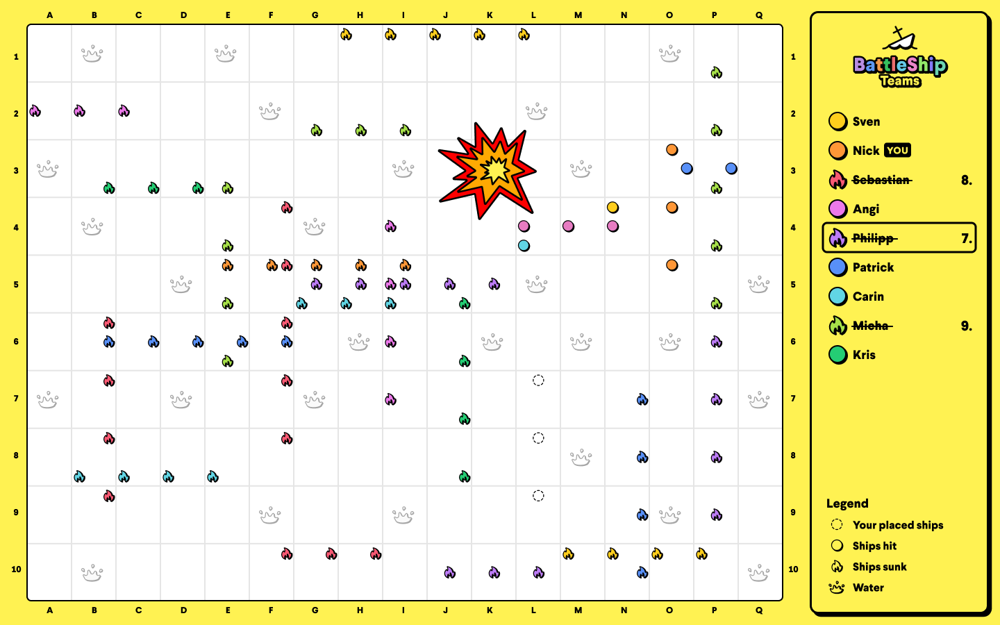

## Folks, we have a problem
Pandemic-driven home office and COVID-19 blues are a massive dealbreaker for face-to-face socializing between employees, reducing their contacts. As a small office, we established a digital get-together every month besides our weekly jour fixe to maintain the personal connections.

We were playing some funny but messy browser games in April 2020 during one of those sessions when someone asked for a battleship game. And guess what? We didn’t find one for more than two players.

Our designer Nick created a rough draft of the coordinate system, sent it as a PDF to the team, and shared his Figma screen as the host of a quick and dirty battleship game. This was epic fun with such a simple solution!

Some online socializing sessions later, we got surprised by a well-designed Figma prototype, a typical move of our dear colleague Nick, who always runs the extra mile as fast as he can, but five times.

## Someone has to build this
This! Was! Impressive! Someone has to build it as a real browser game. We didn’t even finish the sentence when four people already raised their hands and offered. It was one of those euphoric seconds when you feel the infinite momentum of this team.

## Let’s create a browser game
Pumped with the sweet juice of dopamine and sparkling eyes like little children have when cuddling with a puppy dog, we started a Battleship-hackathon. But we quickly realized that we were still missing a ton of designs and product decisions if we wanted to nail it. We decided to choose Timo as product owner, shift the project to our primary work time as an internal product, put one designer and two developers on it almost full-time, and defined a timeline for the first version, including a landing page.

We outbid each other with all kinds of ideas in our kanban board until we decided to do a feature freeze to get the first version. Necessary extra time for product improvements to become an überdosis version of Battleship Teams: + two weeks.

## What the hell have we done?

Six weeks later, we played Battleship Teams in the browser for the first time with nine people, which felt overwhelming. Absolutely, we did it! Six wonderful weeks from a silly idea to a great product. Or, as one of the developers said: “Weird, it doesn’t feel like work, it feels more like coding with a friend on a fun project in my free time.”

Battleship seems like a game created by a team, which radically focused on the people who play it – in this case, themselves.

## LOL, those crazy weirdos
Honestly, we invested a few hundred hours in this game and paid for it by ourselves. You don’t make those kinds of decisions when you have an MBA. But was it worth every penny? It was! And would we do this again? We promise!

It was team-building par excellence, plus we had so much fun developing this game. Work isn’t about making money with every decision you make. It’s about executing your passion, which hopefully results in cash.

[Let’s go for a match of Battleship, ready?](https://battleship-teams.com)