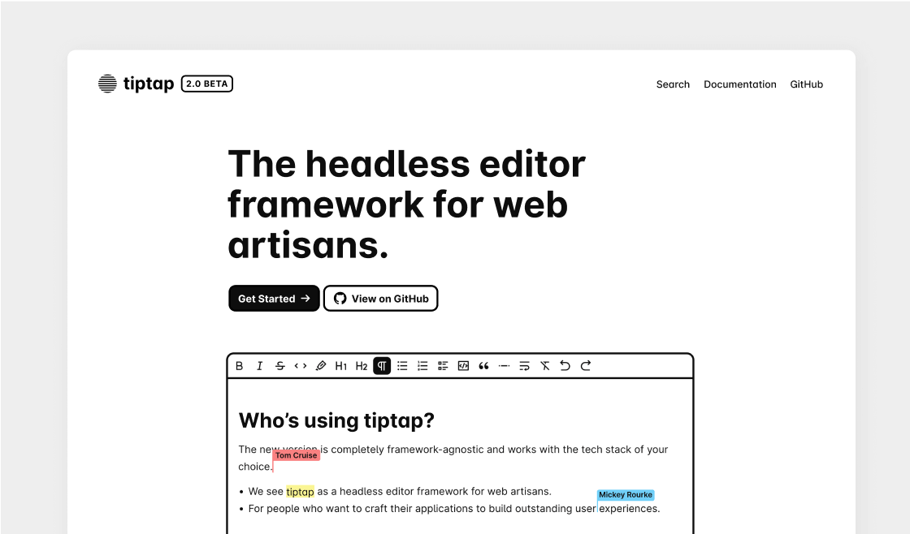
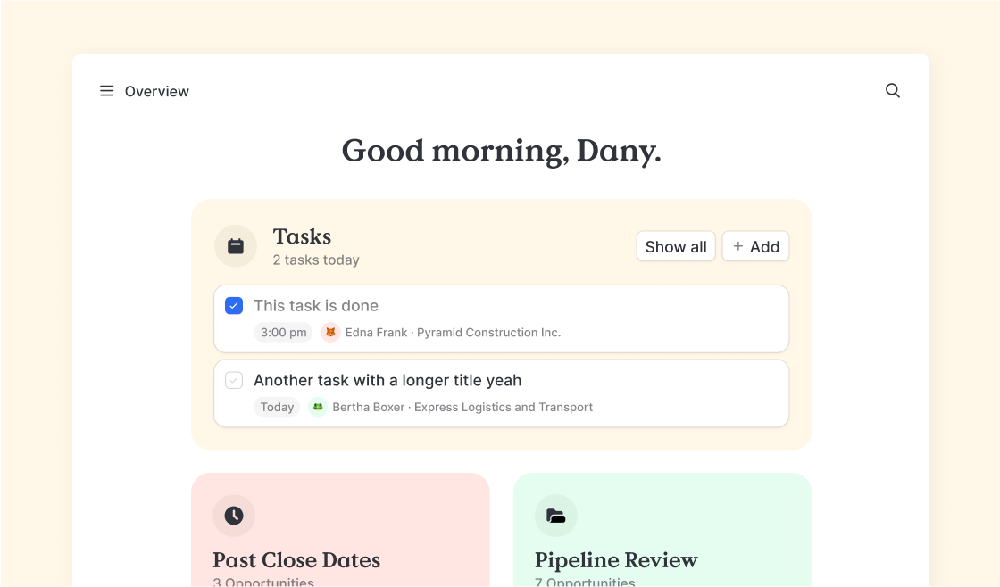
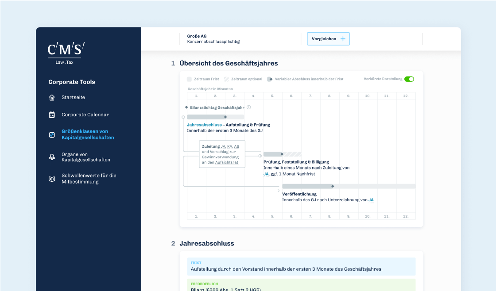

To be honest, we had a rough start in 2021. The landlord discontinued our office rental agreement as of June. Covid-19 blues have delayed the beginning of new projects. Therefore, we had to touch our financial savings for the first time. And the prolongation of the second lockdown in Germany had an extra emotional strain on many of us.

But! Fortunately, we are back on track. We will move to our new office in April. It's just one floor above, and it still looks the same but has a small roof terrace. And even the delayed projects are running again.

## If that wasn’t enough, there is another sad news

Carin, our first employee at überdosis, has left us in February to pursue her passion as a foreign language correspondent. Since 2015, the very beginning of überdosis, Carin has been our Swiss Army Knife in office management. She developed a hell of a lot of processes with us, many of them are the backbone of our success today.

Carin, you are and always will be in our hearts as our first employee. You started this crazy journey of überdosis with us, and it was more than a pleasure to have had you on board. We are so thankful for everything you have done for us, your trust, your loyalty, your honesty, and very especially your patience with us.

There are moments when there’s simply nothing to sugarcoat, and this is one of them. It’s time to say goodbye. From the bottom of our hearts, we wish you all the best, stay well, and stay as you are.

## Welcome Dominik!

Wherever there is bad news, there is also good news. And so is the next one. We welcome Dominik with a very loving hug as a new part of our überdosis family!

Dominik is a highly professional and more than a passionate frontend engineer, and we are so, so glad to have him on board. It feels like our Allstars team is taking shape.

If you want to know more about him, visit him on [Twitter](https://twitter.com/idocodeandstuff) or have a look at his [website](https://bdbch.com).

## Hello tiptap 2 private beta!

With more than six million downloads our text editor tiptap is already powering the text editing interface of hundreds of applications all over the web, including the apps of GitLab, Linear, Statamic, Nextcloud and many, many others.

After eight months of intense work on a successor, it all takes shape. If you want to take it for a test drive, our recent blog post goes more into detail and even has an [interactive demo of the new version](/post/tiptap-2-0-beta/).

It’s still in a private beta, but with the backing of more than 200 sponsors we are about to hit our sponsorship goal on GitHub and plan to release a public version in the next weeks.

Want to talk with us about text editing, collaborative editing, documentation and other things? Reply to this email, we would love to get nerdy with you.

## Meet Laserfocus! It’s Salesforce, without bloat.

Indeed, this company name is as cool as ours, and so is the product designed by us. With Laserfocus, you have a user-friendly, smart and really performant interface on top of your messy Salesforce account. It’s all you need to focus on your job as a successful salesperson.

You have to try this app, if you are an account executive! It’ll easily save you hours every week. Visit [laserfocus.io](https://www.laserfocus.io) to feel the magic!

## Interactive Corporate Tools for CMS Hasche Sigle

This web application is a perfect example of how to digitize business processes, and make complex things accessible to use them for marketing purposes.

Previously, CMS HS clients received a large Excel spreadsheet with a complex answer matrix to specific and recurring corporate law questions. We turned their knowledge into an interactive and easy-to-use app that not only answers the questions but is also accessible to everyone, demonstrating CMS HS expertise in corporate law.

If you need easy but deep insights in corporate law, have a look at [cms-corporate-tools.de](https://cms-corporate-tools.de)

## The all-new IVU Traffic Technologies AG Website

As a global player in building IT systems for bus and rail, IVU needed a new website with clear information architecture and valuable content that would suit their very different international audiences. Well, we designed it and developed its responsive frontend.

Yes, we can also create serious corporate websites, check it out: [ivu.de](https://www.ivu.de)